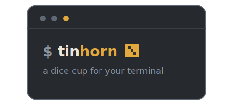
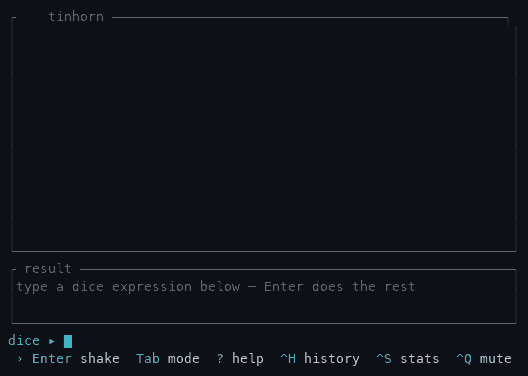

<p align="center">
  
</p>

<p align="center">
  <a href="https://crates.io/crates/tinhorn"></a>
  <a href="https://crates.io/crates/tinhorn"></a>
  <a href="https://github.com/puradox/tinhorn/actions/workflows/ci.yml"></a>
  <a href="#license"></a>
</p>

> A _tinhorn_ is a small-time gambler, named for the tin
> shaker [_chuck-a-luck_][chuck-a-luck] dealers rattled their dice in.

[chuck-a-luck]: https://en.wikipedia.org/wiki/Chuck-a-luck

Step right up: a terminal dice roller with a genuine tin-cup shake — the
dice land how they land. Nothing up these sleeves, friend: seed the roll
(`--seed 42`) and watch the very same throw land twice.



And what'll it cost you to see all this? Not one thin dime!

- **A real physics arena.** Dice are tossed, bounced, knocked together, and
  rolled off each other's backs.
- **[Real pixels](#real-pixels)** in kitty, Ghostty & WezTerm — the arena drawn
  as a true image, sharp block glyphs everywhere else. Same table, same seed.
- **Your throw.** Shake the cup and catch the meter at its peak. Put some
  arm into it!
- **Set the stakes.** Call your number — `d20+5 vs 15` — and the arena hands
  down the verdict, margin and all. Playing it low? `d20 < 10` flips the bet
  to roll-under. The stats pane quotes you fair odds before you take it.
- **Sound from thin air.** Every click, knock, and thunk synthesized live
  from the very impact that made it. No samples anywhere on the premises.
- **[Fancy notation.](#dice-notation)** Advantage, drop-the-lowest,
  exploding dice, multipliers — the works.
- **[One-shot mode](#scripting-one-shot-mode)** for quick gambles.

## Install

You'll need a [Rust toolchain](https://rustup.rs). On Linux, the sound needs
the ALSA headers to build (macOS and Windows need nothing extra):

```sh
sudo apt install libasound2-dev pkg-config   # Debian/Ubuntu
sudo dnf install alsa-lib-devel              # Fedora
```

Then install from crates.io:

```sh
cargo install tinhorn
```

If your fingers insist on the old ways: `alias roll=tinhorn`.

## Run

```sh
tinhorn                  # start empty, type an expression
tinhorn 3d6              # roll 3d6 the moment it opens
tinhorn "d6+d8"          # quote anything with shell-special characters
tinhorn --mute           # start silent (Ctrl-Q toggles at runtime)
tinhorn --graphics blocks # force block glyphs (auto uses real pixels in kitty)
```

> **macOS asked about the microphone?** Recent macOS raises that prompt for
> _any_ app playing audio through an output device that also carries mic
> inputs (a USB interface, a headset) — even Apple's `afplay` trips it.
> tinhorn never records and opens the default output device only, so deny it
> freely; `--mute` skips audio entirely and never asks.

## Keys

| Key                    | Action                                            |
| ---------------------- | ------------------------------------------------- |
| `Enter`                | roll, per the mode (shake: press again to throw)  |
| `Tab`                  | cycle the mode — shake → roll → insta             |
| type / `Backspace`     | edit the dice expression                          |
| `←` `→` (`Home`/`End`) | move the caret in the expression (jump to ends)   |
| `↑` `↓`                | scroll an open pane that's taller than the screen |
| `?`                    | toggle the dice-notation help overlay             |
| `Ctrl-H`               | toggle the roll-history pane                      |
| `Ctrl-S`               | toggle the statistics pane                        |
| `Ctrl-Q`               | mute / unmute — Q for quiet                       |
| `Esc` / `Ctrl-C`       | quit (`Esc` closes a pane or shake first)         |

Three roll modes cycle on `Tab`: **shake** (drop into the cup and catch the
power meter), **roll** (dice tumble straight in), and **insta** (landed and
tallied at once).

## Real pixels

In a terminal that speaks the [kitty graphics protocol][kitty-gfx] — **kitty**,
**Ghostty**, **WezTerm** — the arena isn't text glyphs: the same GPU frame is
handed to the terminal as a _real image_, drawn at your display's resolution
while the chrome is painted around it. Everywhere else it falls back to a blit of
**quadrant block glyphs** (2×2 sub-pixels a cell), and you'd be hard-pressed to
spot the switch.

It's the same table under either one — same camera, same physics, the very same
seeded RNG — so `tinhorn --seed 42 3d6` lands the identical total whether it's
drawn in pixels, in block glyphs, or printed by `-p`. Detection sniffs the
terminal (and stands down under tmux, which quietly eats the picture); force
the call with `--graphics kitty` or `--graphics blocks`.

[kitty-gfx]: https://sw.kovidgoyal.net/kitty/graphics-protocol/

## Dice notation

A roll is a sequence of **dice terms** and optional **flat modifiers**,
separated by `+`, `,`, whitespace, or simply written next to each other. A term
can carry **modifiers** (keep/drop, explode, reroll, multiply) written right
after its `dN`; these apply in pool order — **reroll → explode → keep/drop →
multiply** — and stack. Add **stakes** to check the total against a target.

### The basics

| Input    | Meaning                           |
| -------- | --------------------------------- |
| `3d6`    | three six-sided dice              |
| `d20`    | one die — `d6` means `1d6`        |
| `d%`     | percentile — shorthand for `d100` |
| `d6+d8`  | one d6 and one d8, summed         |
| `2d20-1` | dice plus a flat `+`/`−` modifier |

Sizes are capped (≤ 60 dice, ≤ 1000 sides) so a fat-fingered `999d99999` can't
wedge the renderer.

### Keep / drop

| Input     | Meaning                                            |
| --------- | -------------------------------------------------- |
| `2d20kh1` | **advantage** — roll two d20, keep the highest 1   |
| `2d20kl1` | **disadvantage** — keep the lowest 1               |
| `4d6dl1`  | drop the lowest 1 (the classic ability-score roll) |
| `4d6dh1`  | drop the highest 1                                 |

`kh`/`kl`/`dh`/`dl` default to 1 (`2d20kh` = `2d20kh1`) and clamp to the pool
size. Dropped dice are still thrown and bounce around — you watch advantage
discard the lower d20 — but they're rendered dimmed and left out of the total.

### Stakes

Call a target and the arena hands down a verdict — margin and all. At most one
per roll, and it must come last: `d20 > 4d6` is an error, not a surprise.

| Input        | Meaning                                    |
| ------------ | ------------------------------------------ |
| `d20+5 > 15` | **meet or beat** — succeed on a total ≥ 15 |
| `d20 vs 15`  | the same; `vs` is the word alias for `>`   |
| `d20 < 10`   | **roll-under** — succeed on a total ≤ 10   |

Both comparisons are inclusive: you win *on* the number.

### Exploding

| Input    | Meaning                                     |
| -------- | ------------------------------------------- |
| `3d6!`   | a max face rolls another die (repeats)      |
| `d10!>8` | explode on any face `> 8` (`<` and `=` too) |

Exploding plays out live: a die that _settles_ on a qualifying face drops one
more die into the arena, which can explode in turn — capped at 40 extra dice
per term so `d2!` can't grow without bound.

### Reroll

| Input      | Meaning                                                 |
| ---------- | ------------------------------------------------------- |
| `4d6r1`    | reroll any 1, repeating until it clears                 |
| `d20ro1`   | `ro` rerolls **once** — one redraw, then live with it   |
| `d20r<3`   | a compare point works too (`<`, `>`, `=`); bare `N` = `=N` |
| `6d6r2r4r6`| chain compare points to reroll several faces            |

A reroll throws the old face out before anything else touches the pool, so a
die you'd have dropped or exploded is settled first. The die lands on its
kept face in the arena; a `-v` breakdown shows what was tossed (`1r4` = rolled
a 1, rerolled, kept the 4). A plain `r` whose compare would match *every* face
is rejected (it could never clear); use `ro` if you really mean one redraw.

### Multiply

| Input       | Meaning                                           |
| ----------- | ------------------------------------------------- |
| `4d6*2`     | multiply _this term's_ kept sum by 2              |
| `4d6!kh3*2` | stack them: explode, keep the best 3, then double |

A multiplier binds to its own term: in `3d6*2 + d8` only the d6 sum is doubled.

## Scripting (one-shot mode)

With an output flag — or whenever stdout isn't a terminal — `tinhorn` skips
the animation, evaluates the roll once, prints a result, and exits, so it
drops straight into scripts and pipelines:

```sh
tinhorn -p 3d6              # 13            (just the total)
tinhorn 3d6 | cat           # 13            (piped stdout → one-shot automatically)
total=$(tinhorn -p 2d20kh1) # capture it in a variable
tinhorn --seed 42 4d6dl1    # reproducible: the same seed always rolls the same dice
tinhorn -v 4d6dl1+2         # a full breakdown (dropped dice in [brackets])
tinhorn --json 2d20kh1+3    # machine-readable for jq & friends

tinhorn -p d20+4 vs 14 && echo "the potion works"   # the exit code IS the check
```

Under `-p`/`-v`, a staked roll exits 0 on success and 1 on failure, so scripts
branch on the check itself; `--json` and piped output always exit 0, and a
parse error goes to stderr and exits 2.

The `--json` output carries every die and its flags, the per-term subtotals,
the flat modifier, the total, and — when staked — `target`, `goal`
(`over` or `under`), `success`, and `margin` (how far the check was made or
missed by, whichever way the stake runs).

## Contributing

Want a look behind the table? The design notes, the test suite, and the
house rules all live in [CONTRIBUTING.md](CONTRIBUTING.md) — pull up a
chair.

## License

Licensed under either of

- Apache License, Version 2.0 ([LICENSE-APACHE](LICENSE-APACHE) or
  <http://www.apache.org/licenses/LICENSE-2.0>)
- MIT license ([LICENSE-MIT](LICENSE-MIT) or
  <http://opensource.org/licenses/MIT>)

at your option.

Unless you explicitly state otherwise, any contribution intentionally
submitted for inclusion in the work by you, as defined in the Apache-2.0
license, shall be dual licensed as above, without any additional terms or
conditions.
